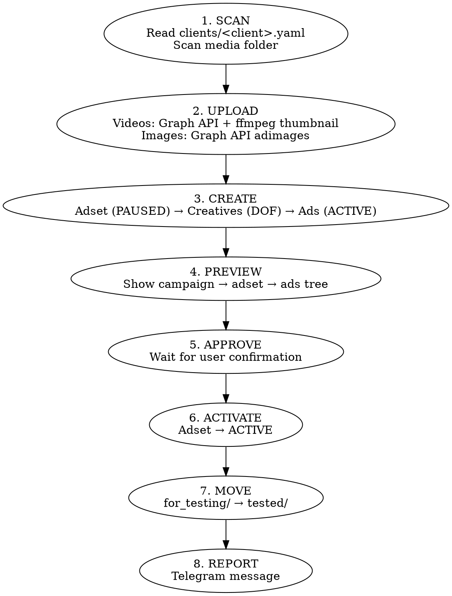

# Deploy Creatives

Deploy video and image creatives to Meta Ads test campaigns.

## Commands

```
/deploy-creatives status              — show pending creatives for all clients
/deploy-creatives status [client]     — show pending creatives for one client
deploy [folder] for [client]          — deploy creatives from folder
```

## Status Command

Scan each client's creative folders for pending creatives.

### Execution

1. Read all YAML configs from `clients/` directory (the plugin ships `examples/clients/example.yaml` as a starter template — copy it into `clients/` and fill in your own account/campaign IDs)
2. For each client, scan for creatives using one of two methods:

**Method A — Local filesystem** (when `creatives_root` path exists):
   - Scan filesystem at `creatives_root`
   - Look for `For_Testing/` or `for_testing/` subdirectory first
   - If no such folder, scan `creatives_root` directly
   - Walk concept folders, count media files (.png, .jpg, .jpeg, .mp4, .mov)

**Method B — Google Drive API** (when local path unavailable, or on remote server):
   - Use `drive_folder_id` from client config
   - Call `mcp__claude_ai_Google_Drive__search_files` with `parentId = '<drive_folder_id>' and mimeType = 'application/vnd.google-apps.folder'` to list subfolders
   - Look for `For_Testing` or `for_testing` subfolder first; if found, use its ID
   - For each concept subfolder, search for media files: `parentId = '<folder_id>' and (mimeType contains 'image/' or mimeType contains 'video/')`
   - Use `modifiedTime` from file metadata for "N days ago"

**Auto-detect:** Try local path first. If it doesn't exist, fall back to Google Drive API.

3. Skip empty folders

### Output Format

```
Creatives Status

=== ClientName ===
path/to/concept_folder:
  concept_1 — X videos, Y images (N days ago)
  concept_2 — X videos, Y images (N days ago)
Total: X videos, Y images

=== ClientName2 ===
  ...
```

- Group by client
- Show relative path from creatives_root
- Sort concepts alphabetically
- Last update: show as "N days ago" — compute from most recent file modification date within the concept folder
- If no pending creatives: "No pending creatives"

## Deploy Workflow

```
User: "deploy [folder] for [client]"
```



**Never activate without approve.** Between PREVIEW and ACTIVATE — mandatory pause.

## Preview Must Include

Every preview shown to the user MUST explicitly state:
- **Ad account** — ID and name from client config
- **Destination URL** — the link from client config (`destination.url` or equivalent)
- Campaign name, adset structure, ad count, daily budget

## Media Upload

### Getting a raw Meta access token (from Pipeboard)

The MCP tools use a cached token internally, but for **direct Graph API uploads** (needed when Drive files are private — see below) you need the raw Meta token. Get it from Pipeboard:

1. Read the Pipeboard API token from `.env` (`PIPEBOARD_API_TOKEN`).
2. Exchange it for the Meta token:
   ```bash
   curl -s "https://pipeboard.co/api/meta/token?api_token=<PIPEBOARD_API_TOKEN>"
   # → {"access_token":"EAA…","token_type":"bearer","expires_at":"2026-08-02T…"}
   ```
   Use `.access_token` (an `EAA…` bearer) for Graph calls. It's long-lived (~2 months). Never print or commit it.

### Where the files are

Resolve your media folder path from the client config's `creatives_root` — this may be a local Drive-for-Desktop sync path (Mac or Windows) or a network/shortcut path that needs resolving to its real target first. Whatever the underlying mechanism, treat `creatives_root` as the single source of truth for where a client's media lives; don't hardcode OS-specific paths in the workflow. Files may stream on demand rather than being fully local.

### Upload method — IMPORTANT

The Drive **public-URL** method (`drive.usercontent.google.com/download?id=…`) only works if the file is shared "anyone with link." For **private** files Meta fetches a Google login page (HTML) and the video silently fails Meta processing ("video failed to process"). When the files are private, **upload the local bytes directly to the Graph API** instead:

```bash
curl -s "https://graph-video.facebook.com/v22.0/<act_id>/advideos" \
  -F "access_token=$TOK" -F "source=@<creatives_root>/for_testing/videos/<concept>/<file>.mp4" \
  -F "name=<stem>"
# → {"id":"<video_id>"}
```

Then build the creative with that `video_id` via `mcp__meta-ads-mcp__create_ad_creative` (DOF). Verify processing with a creative `dry_run` before mass-creating — a fresh upload takes a few seconds to process. Non-resumable upload is fine for files <~50 MB. Use the original Drive-URL/MCP path only when files are confirmed public.

---

Fallback (public files only): upload to Meta via MCP tools using Google Drive download URLs.

### Video upload

1. List files on local filesystem to find concept folders and videos
2. Get Google Drive file IDs via `mcp__claude_ai_Google_Drive__search_files` (search by `parentId` of concept folder)
3. Upload via `mcp__meta-ads-mcp__upload_ad_video` with URL: `https://drive.usercontent.google.com/download?id={file_id}&export=download&confirm=t`
4. For batch uploads use `mcp__meta-ads-mcp__bulk_upload_ad_videos` (max 50 per call)

**Google Drive rate limits:** Batches of 5 videos max, with 5-minute pauses between batches. Expect ~60-80% success rate per batch — retry failures in the next batch. Never send 50 at once.

### Thumbnail

Two options:
- **Default (no extra work):** omit `image_hash` when creating the creative — Meta auto-generates a thumbnail from each video itself. Each video gets its own (satisfies the "never reuse another video's image_hash" rule). Verified working via creative `dry_run`.
- **Explicit first frame (optional):** `ffmpeg -i video.mp4 -vframes 1 -f image2 thumb.jpg` → upload as an ad image → use the returned `image_hash` in `video_data`. Requires ffmpeg + a local file. **Never use another video's image_hash.**

### Processing — IN_PROCESS (IMPORTANT)

Uploaded videos and freshly created creatives are processed **asynchronously** by Meta. Two traps that look like "media is missing":

1. **Bind a video only after it's `ready`.** After `upload_ad_video`, poll `get_ad_video(account_id, video_id)` until `video_status == "ready"` before putting that `video_id` into a creative. A flexible / `asset_feed_spec` video creative bound while the video is still transcoding **renders blank (no media), never delivers, and does NOT self-heal** — Meta accepts it silently. The last-uploaded videos in a batch are the usual victims.
2. **New creatives sit in `IN_PROCESS` for a few minutes.** The creation response shows `"status": "IN_PROCESS"` and the Ads Manager preview shows a grey placeholder until Meta finishes rendering. Don't conclude "media is missing" right after creating — wait 2–3 min and refresh (F5) before judging or activating.

**Fix a creative that renders blank:** recreate it (video now confirmed `ready`) → `update_ad(ad_id, creative_id=<new>)` to swap it in (keeps ad_id + tracking_specs) → `delete_ad_creative(<old>)`. No need to recreate the ad.

### Image upload

Upload via `mcp__meta-ads-mcp__upload_ad_image`:
- Read local file → base64 encode → pass as `image_base64` parameter
- Or use Google Drive download URL as `image_url`

## Creative Rules

### Video

- Format: **DOF** (DEGREES_OF_FREEDOM) — without it Meta shows "video will be masked" warning on Feed for 9:16
- Structure:
  - `object_story_spec.video_data` — video_id, image_hash, call_to_action with link
  - `asset_feed_spec` — bodies, titles, `optimization_type: DEGREES_OF_FREEDOM`
- **MCP `create_ad_creative` quirk (multi-text video):** the DOF structure above is for **direct Graph API** creation. Via the MCP `create_ad_creative` tool, do **NOT** pass `optimization_type=DEGREES_OF_FREEDOM` with a single `video_id` — the tool silently drops the video into `link_data` and the creative has no media. Instead pass `video_id` + plural `messages` / `headlines` / `descriptions` with **no** `optimization_type`; the tool builds `asset_feed_spec.videos` + `ad_formats: SINGLE_VIDEO` correctly (optimization_type comes back `REGULAR`, which still serves multiple text combos).
- **Headline limit:** the MCP tool rejects any headline >40 chars (Meta itself allows longer). Trim before sending.
- **Thumbnail:** extract first frame via `ffmpeg -i video.mp4 -vframes 1 -f image2 thumb.jpg`, upload as image to account, use returned image_hash. Never use another video's image_hash.
- If client config has `app_product_page_id` — add to `asset_feed_spec`

### Image

- Creative via `object_story_spec.image_data` with image_hash + CTA + link

### Common

- Bodies, titles, CTA — from `clients/<client>.yaml` → `creative_defaults`
- Tracking specs — from client config
- If `app_product_page_id` exists in config — always include in `asset_feed_spec`

## Adset Rules

- Create in test campaign from `clients/<client>.yaml` → `test_campaign_id`
- Name: `[concept] DD.MM.YYYY`
- Status: **PAUSED** (until approve)
- **No `is_dynamic_creative: true`** — blocks ad creation/updates via API
- **No `duplicate_adset`** — copies is_dynamic_creative flag from template
- Create adset manually via Graph API, copying settings from template (`template_adset_id`): targeting, billing_event, optimization_goal, bid_strategy, daily_budget, promoted_object
- Ads inside adset: status **ACTIVE**

## Report

After activation — ready-to-paste Telegram message:

```
[concept_1]: XX ads, $XXX/day
[concept_2]: XX ads, $XXX/day
```

Always in USD. Convert from account currency if needed.